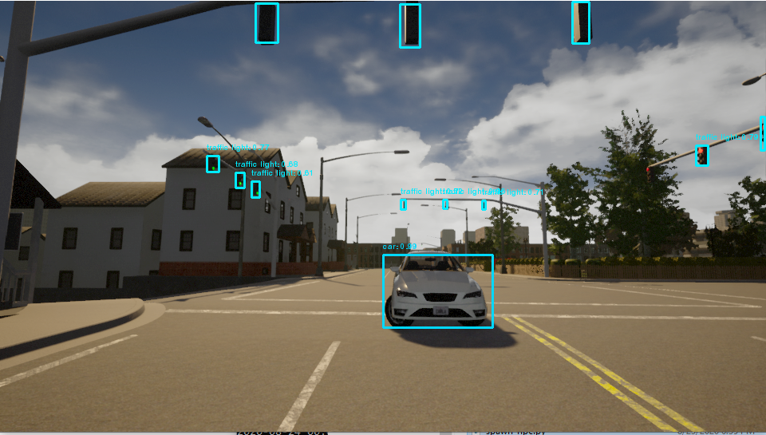

# Carla Simulator YOLOV3 Object Detection Sample

Simple sample for Carla Simulator, object detection with bounding box application with 
yoloV3 (tensorflow 1.15.x)

YoloV3 Tensorflow implementation forked from:
 https://github.com/YunYang1994/tensorflow-yolov3 (branch: [dependabot/pip/docs/tensorflow-gpu-1.15.2](https://github.com/YunYang1994/tensorflow-yolov3/tree/dependabot/pip/docs/tensorflow-gpu-1.15.2))




## My Environment
Windows 10
Carla 0.9.9
python 3.7.5
tensorflow-gpu 1.15.0
pygame 1.9.6
opencv-python 4.2.0.34
numpy 1.18.3
pillow 7.1.2


## Project  Directory Structure
```
.CARLA_0.9.9            
├── WindowsNoEditor
│   │   ├── CarlaUE4
│   │   ├── Co-Simulation
│   │   ├── Engine
│   │   ├── HDMaps
│   │   ├── PythonAPI
│   │   │   ├── carla
│   │   │   ├── util
│   │   │   ├── examples
│   │   │   │ 	├── yolov3_object_detection.py
│   │   │   │ 	├── tensorflow_yolov3     
│   │   │   │ 	│   ├── utils.py            
```

## Setup

1) Open a command line 
Go to the Carla Simulator examples path ..\CARLA_0.9.9\WindowsNoEditor\PythonAPI\examples

	Clone this repo without project folder with the below section

	```
	git init
	git remote add origin https://github.com/umtclskn/Carla_Simulator_YOLOV3_Object_Detection.git
	git pull origin master
	git submodule update --init --recursive
	```

2. Download COCO weights from this link:
	```
	https://github.com/YunYang1994/tensorflow-yolov3/releases/download/v1.0/yolov3_coco.tar.gz
	```
	extract this file under the below path:

	> ..\CARLA_0.9.9\WindowsNoEditor\PythonAPI\examples\tensorflow-yolov3\checkpoint

---
3. (type these command at the  ..\CARLA_0.9.9\WindowsNoEditor\PythonAPI\examples\tensorflow-yolov3)
	```
	cd..
	python convert_weight.py
	python freeze_graph.py
	```
	see the 
4. Open CarlaEU4.exe    (..\CARLA_0.9.9\WindowsNoEditor)

5.  Run spawn actor  python file for  adding pedestrians or vehicles.
	> python spawn_npc.py


6.  Start  vehicles, pedestrains, etc detections with YOLOV3 tensorflow implementation.	
	> python yolov3_object_detection.py
	
	
	


